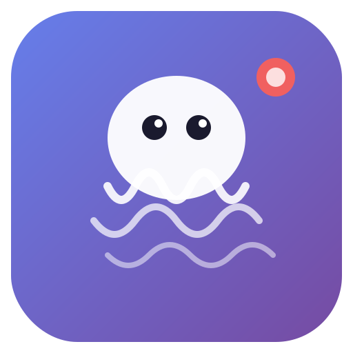

<p align="center">
  
</p>

<h1 align="center">Octo Captures</h1>

<p align="center">
  <strong>Screen Studio 스타일의 화면 녹화 & 편집 앱</strong><br>
  자동 줌, 커서 트래킹, 타임라인 편집을 지원하는 macOS 데스크탑 앱
</p>

<p align="center">
  
  
  
</p>

---

## Features

### Recording
- **화면/윈도우 선택** 녹화
- **커서 위치 트래킹** (30fps, 멀티 모니터 지원)
- **클릭 이벤트 추적** — 녹화 중 마우스 클릭 기록
- **마우스 자동 이동** — 웨이포인트 기반 자동 마우스 움직임/클릭/더블클릭
- **마이크 오디오** 동시 녹음 (선택)
- **화질 선택** (4/8/16 Mbps)
- **글로벌 단축키** `Cmd+Shift+R` 녹화 토글

### Editing
- **Auto Zoom** — 커서 움직임에 따라 자동 줌인/줌아웃 (Screen Studio 스타일)
- **커서 렌더링** — macOS 스타일 커서를 영상 위에 렌더링
- **하이라이트 효과** — 줌 시 커서 주변 밝게, 나머지 어둡게
- **분할 & 삭제** — 타임라인에서 세그먼트 분할 후 선택 삭제 (CapCut 스타일)
- **세그먼트 드래그 & 리사이즈** — 타임라인에서 직접 드래그/리사이즈, 스냅 지원
- **눈금자** — 시간 눈금자에서 드래그로 구간 선택 & 삭제/트림
- **자막** — 10종 애니메이션 (페이드인, 슬라이드, 타이프라이터, 바운스, 글로우 등)
- **텍스트 템플릿** — 미리 정의된 텍스트 스타일 적용
- **트랜지션** — 분할점에 페이드/와이프 전환 효과
- **필터** — 영상 필터 효과 적용
- **색보정** — 밝기, 대비, 채도 조절
- **오디오 파형** — 오디오 트랙 시각화
- **프로젝트 저장/불러오기** — 편집 상태 저장 및 복원
- **Undo/Redo** — 최대 50단계 실행취소

### Export
- **WebM** (VP9/Opus)
- **MP4** (H.264, ffmpeg 필요)
- **GIF** (FPS/크기/품질 조절)

## Keyboard Shortcuts

| Key | Action |
|-----|--------|
| `Space` | 재생/일시정지 |
| `S` | 분할 |
| `C` | 재생헤드 위치 즉시 삭제 |
| `Delete` | 선택 세그먼트 삭제 |
| `T` | 자막 추가 |
| `I` / `O` | IN/OUT 설정 |
| `,` / `.` | 1프레임 뒤/앞 |
| `Arrow` | 1초 이동 (Shift=0.1초, Alt=5초) |
| `Cmd+Z` | 실행취소 |
| `Cmd+Shift+Z` | 다시실행 |
| `Esc` | 선택 취소 |

## Installation

### Download
[Releases](../../releases) 페이지에서 최신 `.dmg` 파일을 다운로드하세요.

### Build from Source

```bash
git clone https://github.com/johunsang/octo-captures.git
cd octo-captures
npm install
npm start        # 개발 실행
npm run build    # macOS 빌드
```

> MP4 내보내기를 사용하려면 ffmpeg가 필요합니다: `brew install ffmpeg`

## Tech Stack

- **Electron 33** — macOS 데스크탑 앱
- **Canvas API** — 실시간 비디오 렌더링 & 효과
- **MediaRecorder API** — 화면 캡처 & 내보내기
- **gif.js** — GIF 인코딩

## License

MIT
